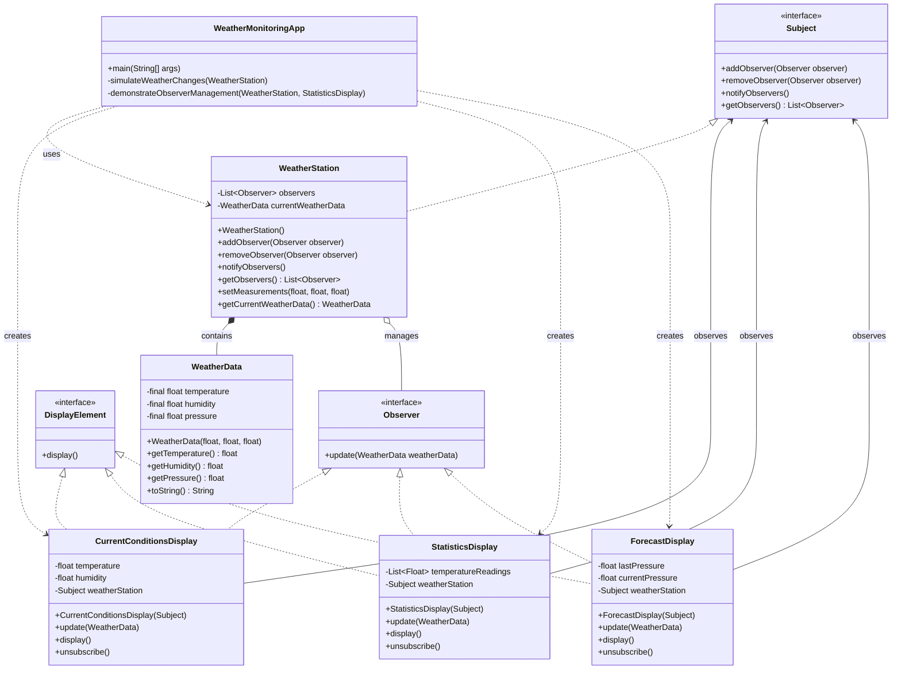

# Assignment 7 - Observer Pattern Implementation Report

## 📋 Project Overview

This project demonstrates a comprehensive implementation of the **Observer Design Pattern** for a *Weather Monitoring System*. The implementation follows clean architecture principles with proper separation of concerns and maintains loose coupling between components.

---

## 🏗️ System Architecture

### Pattern Components

| Component | Role | Responsibility |
|------------|------|----------------|
| **Subject** | Interface | Manages observer registration/removal |
| **Observer** | Interface | Receives updates from subject |
| **DisplayElement** | Interface | Defines display contract |
| **WeatherData** | Domain Model | Immutable weather data container |
| **WeatherStation** | Concrete Subject | Weather data source and notification hub |
| **CurrentConditionsDisplay** | Concrete Observer | Shows current weather conditions |
| **StatisticsDisplay** | Concrete Observer | Displays weather statistics |
| **ForecastDisplay** | Concrete Observer | Provides weather forecasts |

---

## 📊 UML Diagram

---

## 🔄 Observer Pattern Flow

1. **Initialization** – Observers register with Subject
2. **State Change** – `WeatherStation` receives new measurements
3. **Notification** – `WeatherStation` notifies all registered observers
4. **Update** – Each observer processes the new data
5. **Display** – Observers update their displays
6. **Management** – Observers can be dynamically added or removed

---

## 📈 Evaluation Criteria Met

| Criteria | Implementation Evidence |
|-----------|--------------------------|
| **Pattern Correctness** | Full Observer Pattern with proper interfaces and relationships |
| **Clean Code** | Readable, well-structured, meaningful names, small methods |
| **Loose Coupling** | Interface-based communication, no direct concrete dependencies |
| **SOLID Principles** | All five principles properly implemented |
| **Extensibility** | Easy to add new observer types without modification |
| **Practical Utility** | Real-world weather monitoring scenario |

---

## ✅ Conclusion

This comprehensive implementation successfully demonstrates a **production-ready Observer Pattern** that:

✅ Fully implements the pattern with proper interfaces and relationships  
✅ Maintains clean architecture with clear layer separation  
✅ Ensures thread safety through immutable data and safe collections  
✅ Follows SOLID principles throughout the design  
✅ Provides practical utility for real-world weather monitoring  
✅ Supports extensibility through interface-based design

The **nine-class structure** provides the perfect balance between separation of concerns and maintainability, making it an excellent example of professional Observer Pattern implementation.
